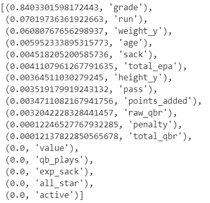
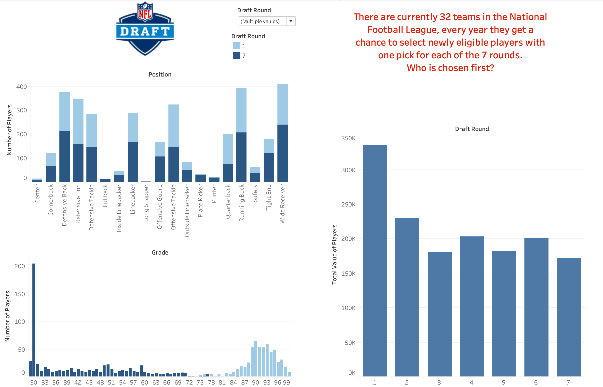
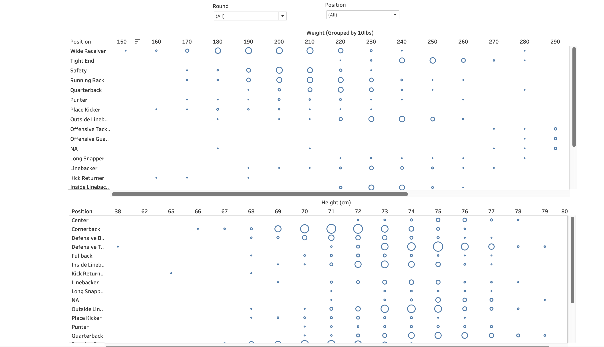
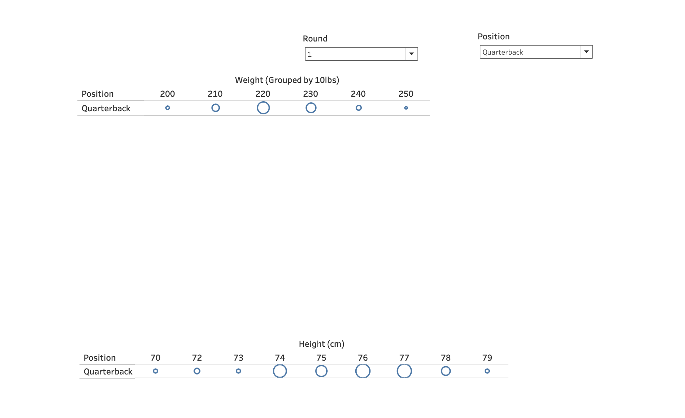

# College Football to NFL Draft Project
_Project by: Amanda Krest and Tiffany Yuk_

## Project Topic, Background, Audience

#### Project Goal
Looking at a dataset about ESPN NFL players from 1967-present from Kaggle, we would like to create a model predicting which players will be picked for the next NFL players based on stats. 
https://www.kaggle.com/datasets/jacklichtenstein/espn-nfl-draft-prospect-data

#### Project Factors
* **Target Variable**
  * Overall 

* **Features**
  * Age
  * Total_qbr (adjusted total QB rating)
  * Points_added (numbers of points contributed by a QB)
  * Qb_plays (plays  on which the QB has a non-zero expected points contribution)
  * Total_epa (total expected points added with low leverage plays)
  * Pass (expected points added on pass attempts)
  * Run (clutch-weighted expected points added through rushes)
  * Exp_sack (clutch-weighted expected points lost from sacks)
  * Penalty (expected points added on penalities)
  * Raw_qbr(raw total QB rating)
  * Sack(expected points added on sacks with low leverage plays down-weighted)
  * Value(statistic value)
  * Active (active player?)
  * All_star (all-star in college)
  * Grade (player grade)
  * Weight
  * Height

#### Technologies Used
* **Data Cleaning and Analysis**
  * Jupyter Notebook
* **Machine Learning Model**
  * Jupyter Notebook
* **Visualization**
  * Tableau Public
  
## Data Exploration and Analysis Phases
 
## ETL Method
  ### Extracting the Data
  Our data was contained from five different datasets about ESPN NFL players from 1967-present from Kaggle. In total there were over 30 columns and over 4,000 rows. 
  * College QB metrics for every quarterback since 2004
  * NFL Draft Prospects from 1967 to now
  * NFL Draft Profiles (Contained more information about the players)
  * Ids
  * College Statistics(Contained certain statistics about the players)   
  ### Transforming the Data
  We then merged the dataset and removed any null values as well as unnecessary columns like school colors, school name, draft year, etc. This ensures that our dataset is clean and ready for analysis.   
  ### Loading the Data
  After removing the unnessary columns and null values, we had 17 columns and 4403 rows. 

## Machine Learning
  ### Model Choice
  The model we chose to use was the **Logistic Regression Model**. The reason why we chose to do logistic regression model was because it offers insights into the relationship between the features and likelihood of the outcome. 
  ### Process
  * Our journey began by dividing the data into labels and features, with 'overall' serving as the target variable. Initially, we assessed the balance of our target variable, 'overall', which appeared slightly skewed but manageable. 
  
  * Although the initial model's accuracy was respectable, we recognized room for improvement.
  
  * Delving deeper, we examined the classification report, revealing an accuracy of 0.77. While precision and recall were not bad, there was potential for enhancement.
  
  * For the second model, we addressed the imbalance in the target variable, resulting in a more equitable distribution.
  
  * The refined model exhibited significantly improved performance, as reflected in the enhanced balanced accuracy score.
  
  * Looking at the new classification report. The accuracy was 0.89 which is definitely higher than the original model. 
  
  * Finally, upon inspecting the importance of the features, we can see that 'grade', 'run', and 'weight' were the most important features. While 'value', 'qb_plays', 'exp_sack', 'all_star', and 'active' demonstrated negligible importance, suggesting minimal impact on model predictions.
  

## Dashboard
[Tableau Dashboard](https://public.tableau.com/views/Project4_17077833437840/NFLDraftStory?:language=en-US&publish=yes&:sid=&:display_count=n&:origin=viz_share_link)

The dashboard presents which factors have the most impact on a player being drafted in the first round, compared to the latter 6 rounds. 
* **These factors include:**
   * Position
   * Grade
   * Value/Statistics
   * Height
   * Weight

The dashboard has two parts. The first part presents an overview of the grade, position, and value of players who have been drafted over the years. 

The second part breaks down how common the height and weight of drafted players are by position and round drafted. 

 ### Interactive Elements
 The dashboard we created is very interactive with the use of the filter action. The grade and position visuals can be filtered on the first page by draft round. On the second page, the weight and height graphs can be filtered by both position and draft round. The filter action adjusts the data behind the scenes and presents a visual with data based on what was chosen. All filters are in dropdown menus that allow for multiple values to be chosen. 
 

## Conclusion
  ### Results
  * **Model 1**
   * Model: Logistic Regression with standard fit
   * Accuracy: 72%
  *  **Model 2**
   * Model: Logistic Regression with scaler fit and oversampled data
   * Accuracy: 94% 

  ### Summary
  Our models showed that grade, weight, and run were the most important factors in deciding which round of the NFL draft players were picked in. There are countless factors, many of which are subjective, that determine who gets drafted and by which franchise. Our model can be used to help coaches and owners in the scouting process by knowing what to look for or to narrow down which players may be available in the later rounds. 

## Future Projects
* For a future project, incorporating the 'statistics' column would be a good idea. The column encompasses essential counting metrics such as tackles, receiving touchdowns, and more depending on the player's season. Having this info would make it easier to figure out which players would be a great candidate for the NFL.
* Including NFL scouting combine data could also be useful. During the combine, all players who have declared for the draft take part in drills that measure speed, strength, and positional proficiency. Our model would benefit from this data because it provides more secular information on individual players and their athletic ability. In our model, we saw that weight was one of the most influential factors, adding combine data would add more physical factors to the model. 

